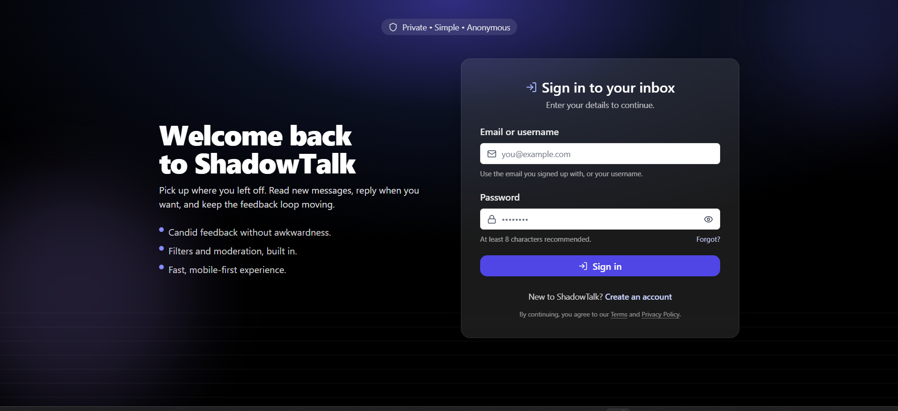
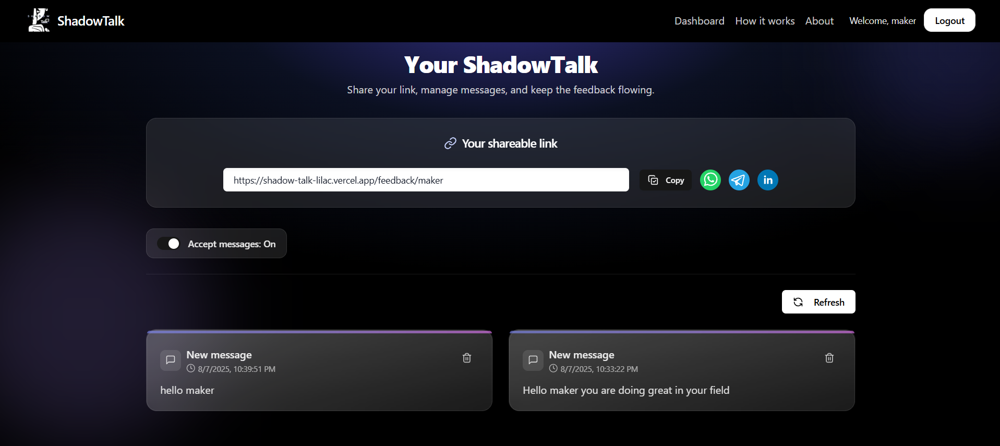
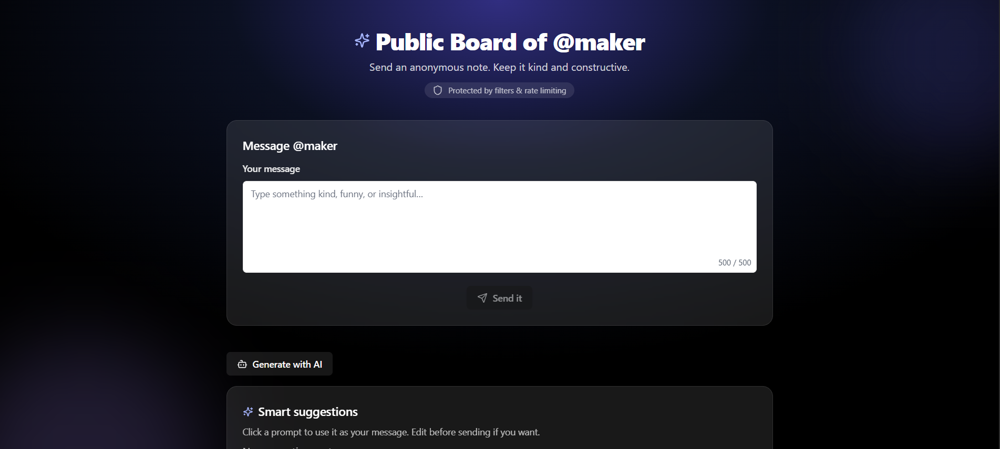

# ShadowTalk 🕵️‍♂️💬  
**Anonymous Message & Review Sharing Platform**  

ShadowTalk is a secure and anonymous message-sharing platform where users can receive anonymous feedback, reviews, or messages from others.  
Built with **Next.js (Fullstack), Tailwind CSS, and MongoDB**, ShadowTalk ensures **privacy, security, and user control** while also leveraging **AI-powered insights** on received messages.  

---

## 🚀 Features  
✔️ **User Authentication** – Secure OTP-based signup & login  
✔️ **Anonymous Messaging** – Receive feedback or reviews without revealing identity  
✔️ **Custom Shareable Links** – Each user gets a unique link to collect messages  
✔️ **Message Control** – Enable/disable anonymous reception anytime  
✔️ **Message Management** – View & delete messages from dashboard  
✔️ **AI-Powered Suggestions** – AI generates **smart replies/suggestions** for received messages  
✔️ **Sentiment Classification** – Messages are automatically categorized as **Positive, Negative, or Neutral**  
✔️ **Database Storage** – Secure storage with MongoDB  
✔️ **Responsive UI** – Clean and modern interface built with Tailwind CSS  

---

## 🖼️ Screenshots / Demo  

### 🔑 Authentication Flow  
  

### 💬 Anonymous Messaging  
  

### 🤖 AI Suggestions & Sentiment Analysis  
  

---

## 🛠 Tech Stack  
- **Framework:** Next.js (Fullstack – frontend + backend routes)  
- **Styling:** Tailwind CSS  
- **Database:** MongoDB  
- **Authentication:** OTP verification via Email (Brevo/Mailgun/AWS SES)  
- **AI Integration:** OpenAI / Hugging Face for message suggestions & sentiment analysis  

---

## 🎯 How It Works  
1️⃣ **Sign up/login** with OTP verification  
2️⃣ **Get your personal anonymous link** & share it anywhere  
3️⃣ **Receive messages** from others securely & anonymously  
4️⃣ **AI analyzes messages** → provides suggested replies & sentiment classification  
5️⃣ **Manage messages** – Allow, delete, or respond as needed  

---

## 🔮 Future Enhancements  
- 🎭 Emoji-based sentiment visualization  
- 📊 Analytics dashboard to track message trends  
- 🌍 Multi-language support for sentiment detection  
- 🔔 Real-time notifications on new messages  

---

## 📬 Contact  
- **GitHub:** [Anuj-0-3](https://github.com/Anuj-0-3)  
- **Portfolio:** [anuj-delta.vercel.app](https://anuj-delta.vercel.app)  

---
⭐ Don’t forget to **star** the repo if you find this project interesting!
